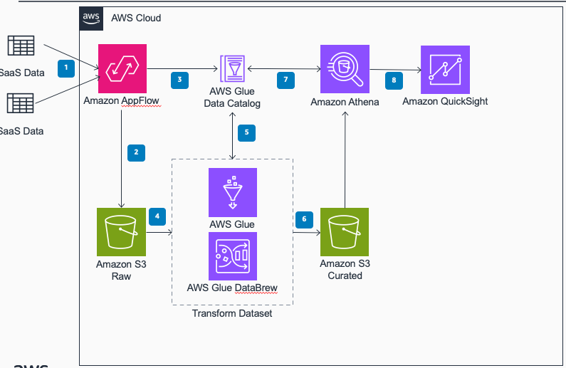
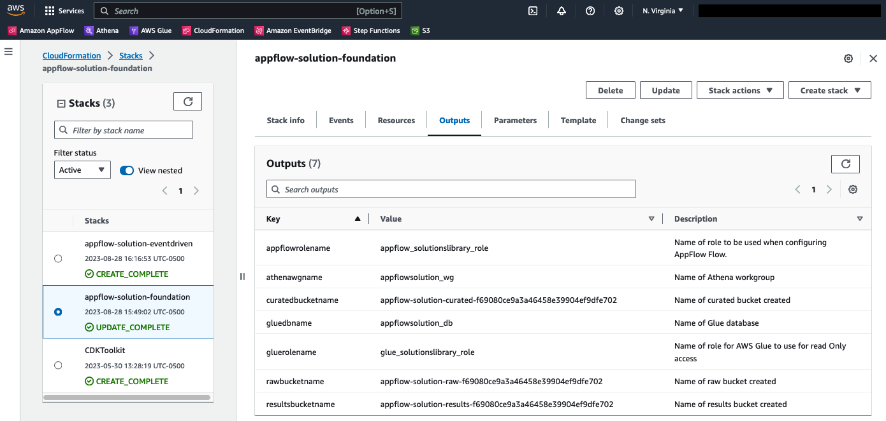
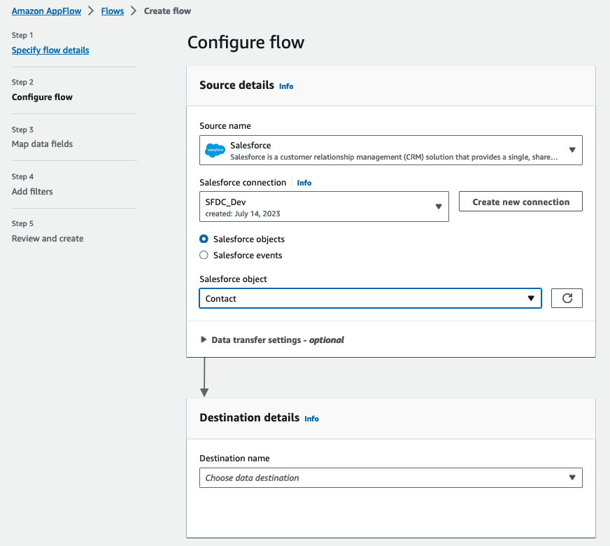
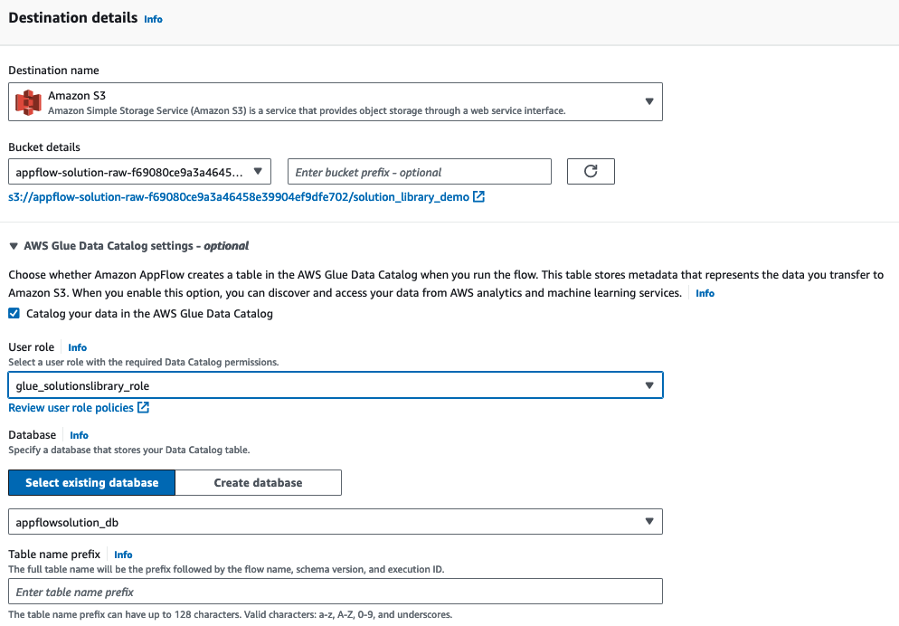
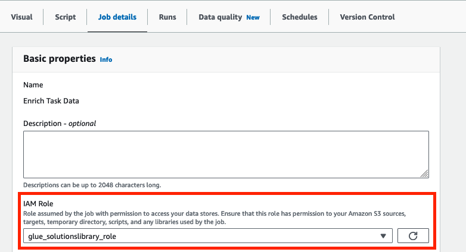
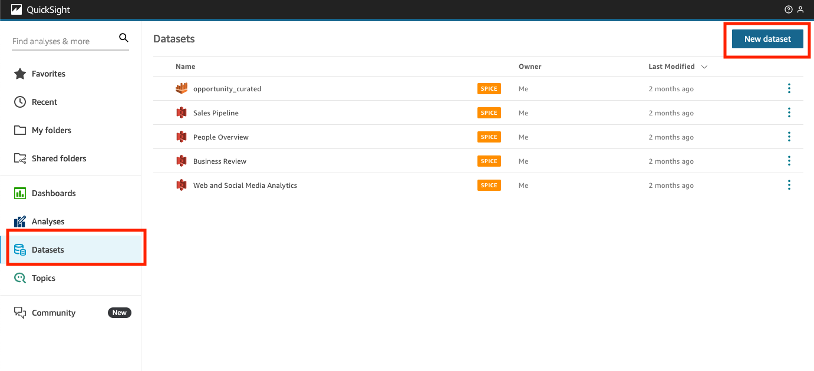
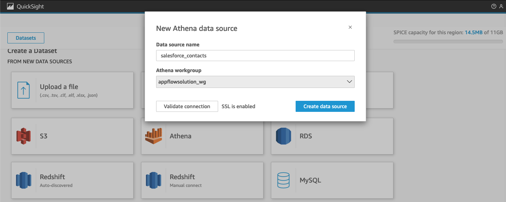
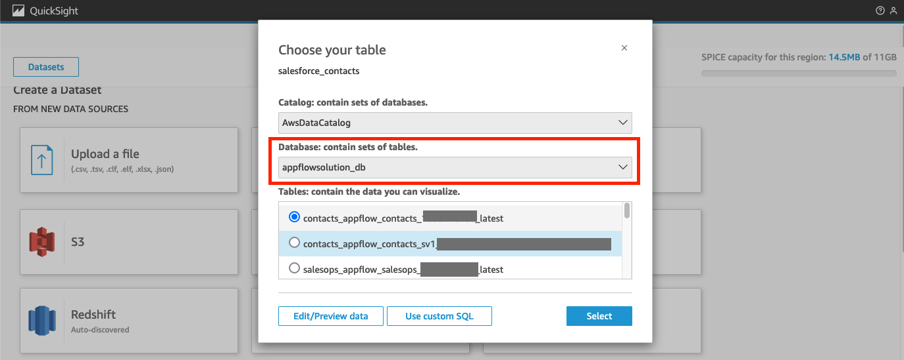
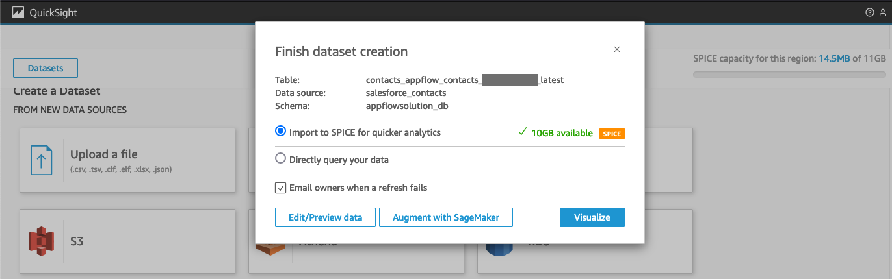

# Guidance for Integrating 3rd Party SaaS Data with Amazon AppFlow

Welcome to Guidance for Integrating 3rd Party SaaS Data with Amazon AppFlow!
## Overview
Customers work with a variety of SaaS providers that keep their data in silos. By using AppFlow to retrieve data, customers are able to quickly, and easily pull and catalog the data to a central data lake in S3. Once data is in S3, customers would be able to prepare data for machine learning, cleans the data, or load it into a Redshift DW.

In this guidance, we are going to deploy the necessary resources to sync data from Salesforce, and load it into Amazon S3.
Athena will serve as the querying engine to load data into Amazon QuickSight.

There is going to be an optional stack deployment that will enable you to run your AWS Glue ETL job based on AppFlow End Flow Run Report results in EventEngine.

## Solution Architecture for Integrating 3rd Party SaaS Data with Amazon AppFlow

## Prerequisites
For being able to follow this solution, you will need:
- An AWS account with sufficient permissions to deploy this solution.
- Have a SaaS application, such as Salesforce or ServiceNow, that is supported and meets the requirements found [here](https://docs.aws.amazon.com/appflow/latest/userguide/app-specific.html) for their respective applications.
## Deploying Solution
In this guidance, we are going to import Salesforce opportunities into S3 as they are created, and create a pipeline to transform the dataset and make it avaiable to import into QuickSight.

### **Step 1** Deploying CloudFormation Template or CDK stack
There are 2 ways that you can deploy the foundational resources.
- The first method is using uploading this CF template [appflow_solution_library_foundation_cf.json](appflow_solution_library_foundation_cf.json),  
into the [CloudFormation Console](https://console.aws.amazon.com/cloudformation).
- The second method is to use  the [AWS Cloud Development Kit](https://aws.amazon.com/cdk/)(CDK).
The code and instructions to deploy this solution with CDK can be found in the [AppFlow Solution CDK](appflow_solution_cdk) directory.

This guide will focus on using CloudFormation to deploy all resources.  
The CloudFormation template will create the following resources that are needed for creating an AppFlow Flow:
- Amazon S3 Bucket:
  - `RawBucket` bucket where raw data from AppFlow will land.
  - `ResultsBucket` bucket where the athena query will store query results.
  - `CuratedBucket` bucket where transformed data will be stored.
- IAM Policy:
  - `appflow_s3_solutionslibrary_policy` is based off this guide: [Amazon S3 Bucket Policies for Amazon AppFlow](https://docs.aws.amazon.com/appflow/latest/userguide/s3-policies-management.html)
  - `appflow_glue_solutionslibrary_policy` is based on this guide: [Allow Amazon AppFlow to access the AWS Glue Data Catalog](https://docs.aws.amazon.com/appflow/latest/userguide/security_iam_id-based-policy-examples.html#security_iam_id-based-policy-examples-access-gdc)
- Glue Database:
  - `GlueAppFlowDB` database will serve as the
- IAM Role:
  - `appflow_solutionslibrary_role` is an AppFlow service role that attaches `appflow_s3_solutionslibrary_policy` and `appflow_glue_solutionslibrary_policy` and includes a trust policy based on this guide: [Service role policies for Amazon AppFlow](https://docs.aws.amazon.com/appflow/latest/userguide/security_iam_service-role-policies.html#access-gdc)
- Athena Workgroup:
  -  `appflow_workgroup` workgroup is configured to write results into `ResultsBucket`

Fill in the parameter fields:
- `GlueDatabaseName` and `AthenaWGName` will have valid default names, but users have the option of changing the values as long as they are unique to the account the template is deployed in.
- `RawBucketName`,`CuratedBucketName`, and `ResultsBucketName`  must be globally unique names and can consist only of lowercase letters, numbers, dots (.), and hyphens (-). Refer to [Bucket Naming Rules](https://docs.aws.amazon.com/AmazonS3/latest/userguide/bucketnamingrules.html?icmpid=docs_amazons3_console) for more information.
  - When making names for the S3 buckets, it is best to include some sort of naming convention that allows you to identify at a glance what data the bucket is storing. Using a distinct value, such as account number or random value, you can use the following starters:
    - `RawBucketName` can be named `appflow-solution-raw-[random_value]`
    - `CuratedBucketName` can be named `appflow-solution-curated-[random_value]`
    - `ResultsBucketName` can be named `appflow-solution-results-[random_value]`

After the CloudFormation Template has been created, click on the Outputs tab. This will provide you the names of resources that will need to be referenced later.

### **Step 2** Set up AppFlow Connector
Next step is to create a connection profile to connect Salesforce to AppFlow. For Connecting Salesforce to AppFlow, detailed instructions could be found here: [Connecting Amazon AppFlow to your Salesforce account](https://docs.aws.amazon.com/appflow/latest/userguide/salesforce.html). If you are using a service other than Salesforce, you can find instructions for your supported application [here](https://docs.aws.amazon.com/appflow/latest/userguide/app-specific.html). Follow the instructions for your respective application.

### **Step 3** Set up AppFlow Flow
Once an AppFlow Connection Profile is created, create a Flow by going to [Amazon AppFlow](https://console.aws.amazon.com/appflow/home), then click *Flows* and *Create Flow*.
Follow this guide, [Create a flow using the AWS console](https://docs.aws.amazon.com/appflow/latest/userguide/create-flow-console.html), to configuring your Flow. When you get to *Configure flow*, this is where you will need to configure Source details and Destination details. The rest of the setup can be completed using the guide.
#### Configure Source Details:
- For Source Details, you will use the Connector that was created in Step 2.
- Once there, you can pick the object that you want to pull into AWS.

#### Configure Destination Details:
- When configuring the Destination Details, use Amazon S3 as the destination.
  - For Bucket Details, use the Raw Data Bucket created in the CloudFormation Template. To get the name, go to the CloudFormation Stack and click *Outputs*, find the `rawbucketname` key and use this bucket for your raw data landing bucket.
  - Click the *AWS Glue Data Catalog settings - optional* dropdown, and check *Catalog your data in the AWS Glue Data Catalog*.
    - For user role, use the custom role created in the CloudFormation template called `glue_solutionlibrary_role`
    - For Database, use `appflowsolution_db` as the database and provide a table name of your choice.

For this Guide, we suggest that you use on demand to have control on when it runs. It can later be changed to run on a schedule.

Configure the rest of the Flow based on your needs, if you only need a subset of column, or need to filter the data.

Once fully configured, review the Flow and click *Run Flow*. This will pull in the data that you specified using AppFlow and load it into the S3 bucket.

### **Step 4** Enrich data using AWS Glue ***(Optional)***
AWS Glue is used to enhance the data that you brought in to AWS with AppFlow. This is an optional step depending on the needs for your Business Intelligence. If the data is already in a format that you need it, and there is no need to transform the dataset, you can skip this step.
If you want to perform transformations, such as aggregating, joining, change schema, or partitioning data, then AWS Glue will preform the transformations. In this guide, we are going to preform a simple transformation where the contacts brought into AWS are going to be deduplicated and converted into a schema that our downstream systems require.

#### Transform or enhance the data with Glue Studio
Follow this guide, [Creating ETL jobs with AWS Glue Studio](https://docs.aws.amazon.com/glue/latest/ug/creating-jobs-chapter.html), to create a job on AWS Glue.

When you get to configuring *job details*, an AWS Glue Role named `glue_solutionslibrary_role` was created that allows glue read only access to the `Raw_Data` bucket, and grants read and write access to the `Curated_Data` bucket. Attach this role to your job to grant it access to all the necessary resources and perform the necessary actions.

### **Step 5** Create Trigger to run AWS Glue Job ***(Optional)***
This step is optional. This step will create resources for automating your data pipeline and having it be event driven to trigger based on the results of the AppFlow End Flow Run Report.
By deploying the [appflow_solution_library_eventdriven_cf.json](appflow_solution_library_eventdriven_cf.json) template, this will deploy an EventBridge Rule that will trigger an AWS Lambda function to run the AWS Glue Job whenever the AppFlow finishes running and pulls data from the source. If you prefer to use CDK, the code and instructions to deploy this solution with CDK can be found in the [AppFlow Solution CDK](appflow_solution_cdk) directory. Please follow the instructions for Deploying `appflow-solution-eventdriven` stack

#### Pre-requisites:
- Create an AppFlow Flow that you want to serve a trigger to run your Glue Job.
- Create an AWS Glue Job to run automatically after the AppFlow Flow finishes running.

#### Deploy CloudFormation Template
 Once you have created the pre-requisite resources, you will need to get the names of the resources and enter this information into the Parameters of the CloudFormation template.
- `gluejobname` is the name of the AWS Glue job you want to run automatically. You can find this in the AWS Console by going to [AWS Glue](https://console.aws.amazon.com/glue/home), then clicking ETL jobs.
- `flowname` is the name of the AppFlow Flow that was created to pull data from your SaaS into AWS. This is the Flow you want to monitor and serve as your trigger to run the AWS Glue Job. You can find this in the AWS Console by going to [Amazon AppFlow](https://console.aws.amazon.com/appflow/home), then clicking on Flows.

Finish Deploying the CloudFormation Template, and all the resources will be provisioned and run when your flow finishes running.

### **Step 6** Query data with Athena
The `appflowsolution_wg` workgroup was created in Amazon Athena that has been pre-configured to store query results in the Results bucket. By going to [Athena Query Editor](https://console.aws.amazon.com/athena/home), you will need to select the `appflowsolution_wg` workgroup. Then under database, select `appflowsolution_db`, then you will see the available tables you can run SQL queries on. This allows you to explore the dataset, and run standard SQL operations to filter, join, and aggregate the datasets inside the `appflowsolution_db` database.

### **Step 7** Connect Athena to QuickSight ***(Optional)***
This may incur a recurring monthly charge since QuickSight is a subscription and is charged per user. Only proceed if you accept the charges, or already have a QuickSight active account.

Follow this guide, [Signing up for an Amazon QuickSight subscription](https://docs.aws.amazon.com/quicksight/latest/user/signing-up.html), if you want to sign up for QuickSight.

To create a dataset in QuickSight, click `Datasets`, then `New dataset`.

Select `Athena` then provide a name for your data source, and in athena workgroup select `appflowsolution_wg`.
Click `Validate Connection` to verify that the data source is accessible by QuickSight, then click `Create data source`.

Under Database, select `appflowsolution_db` then select the table you want to bring into QuickSight.

review if you want to Import the dataset using SPICE or direct query, then click visualize.

## Cleanup
Upon completing this guidance, you have the option to retain or delete the resources created in this
- Delete the Cloud Formation Templates that were deployed. By default, the S3 buckets that were created will be retained, so you will need to delete these manually.
- Check QuickSight for any Datasets that you no longer need.
- Check AWS Glue for any jobs that you manually created and see if you want to retain or delete them.

in the next sc
- Create Dataset
- Generate visualization

## Security

See [CONTRIBUTING](CONTRIBUTING.md#security-issue-notifications) for more information.

## License

This library is licensed under the MIT-0 License. See the LICENSE file.

