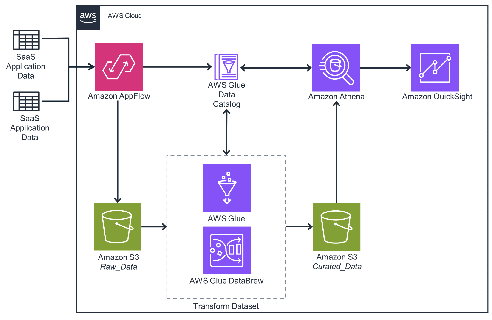

# Guidance for Integrating 3rd Party SaaS Data with Amazon AppFlow

Welcome to Amazon EKS Blueprints for Terraform!
## Overview
Customers work with a variety of SaaS providers that keep their data in silos. By using AppFlow to retrieve data, customers are able to quickly, and easily pull and catalog the data to a central data lake in S3. Once data is in S3, customers would be able to prepare data for machine learning, cleans the data, or load it into a Redshift DW.

In this guidance, we are going to deploy the necessary resources to sync data from Salesforce, and load it into Amazon S3. 
Athena will serve as the querying engine to load data into Amazon QuickSight.

## Solution Architecture for Integrating 3rd Party SaaS Data with Amazon AppFlow

## Prerequisites
For being able to follow this solution, you will need:  
- An AWS account with sufficient permissions to deploy this solution.
- Supported SaaS application, such as Salesforce or ServiceNow, from the [AppFlow supported applications](https://docs.aws.amazon.com/appflow/latest/userguide/app-specific.html). 
- Meet the requirements specific to your application. Please find and review the requirements for your application [here](https://docs.aws.amazon.com/appflow/latest/userguide/app-specific.html).

## Deploying Solution
In this guidance, we are going to import Salesforce opportunities into S3 as they are created, and create a pipeline to transform the dataset and make it avaiable to import into Quicksight. 

### **Step 1** Deploying CloudFormation Template
Upload this CF template [appflow-solution.json](appflow_solution_library_cf.json), into the [CloudFormation Console](https://console.aws.amazon.com/cloudformation)
or deploy it by clicking this link:

The CloudFormation template will create the following resources that are needed for creating an AppFlow Flow:
- Amazon S3 Bucket:
  - `RawBucket` bucket where raw data from AppFlow will land.
  - `ResultsBucket` bucket where the athena query will store query results.
  - `CuratedBucket` bucket where transformed data will be stored.
- IAM Policy:
  - `appflow_s3_solutionslibrary_policy` is based off this guide: [Amazon S3 Bucket Policies for Amazon AppFlow](https://docs.aws.amazon.com/appflow/latest/userguide/s3-policies-management.html)
  - `appflow_glue_solutionslibrary_policy` is based on this guide: [Allow Amazon AppFlow to access the AWS Glue Data Catalog](https://docs.aws.amazon.com/appflow/latest/userguide/security_iam_id-based-policy-examples.html#security_iam_id-based-policy-examples-access-gdc)
- Glue Database:
  - `GlueAppFlowDB` database will serve as the 
- IAM Role: 
  - `appflow_solutionslibrary_role` is an AppFlow service role that attaches `appflow_s3_solutionslibrary_policy` and `appflow_glue_solutionslibrary_policy` and includes a trust policy based on this guide: [Service role policies for Amazon AppFlow](https://docs.aws.amazon.com/appflow/latest/userguide/security_iam_service-role-policies.html#access-gdc)
- Athena Workgroup:
  -  `appflow_workgroup` workgroup is configured to write results into `ResultsBucket`

Fill in the paramter fields:
- `RawBucketName`
- `CuratedBucketName`
- `ResultBucketName`
- `GlueDatabaseName`
- `AthenaWGName`

### **Step 2** Set up AppFlow Connector
Next step is to create a connection profile to connect Salesforce to AppFlow. For Connecting Salesforce to AppFlow, detailed instructions could be found here: [Connecting Amazon AppFlow to your Salesforce account](https://docs.aws.amazon.com/appflow/latest/userguide/salesforce.html). If you are using a service other than Salesforce, you can find your supported application [here](https://docs.aws.amazon.com/appflow/latest/userguide/app-specific.html). Follow the instructions for your respective application, and the connection will provide you access 
[Manage Connections](https://console.aws.amazon.com/appflow/home#/connections)

### **Step 3** Set up AppFlow Flow
Once an AppFlow Connection Profile is created, create a [flow](https://console.aws.amazon.com/appflow/home#/create/1)

### **Step 4** Enrich data using AWS Glue

### **Step 5** Query data with Athena 

### ***Step 6 Optional*** Connect Athena to Quicksight
This may incure a recuring monthly charge since Quicksight is a subscription and is charged per user.
- Subscribe to Quicksight
- Create Dataset
- Generate visualization

## Security

See [CONTRIBUTING](CONTRIBUTING.md#security-issue-notifications) for more information.

## License

This library is licensed under the MIT-0 License. See the LICENSE file.

